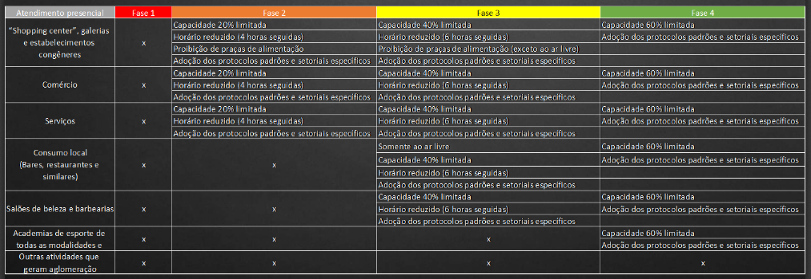
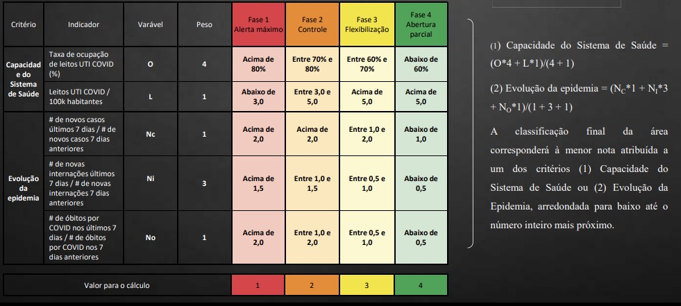
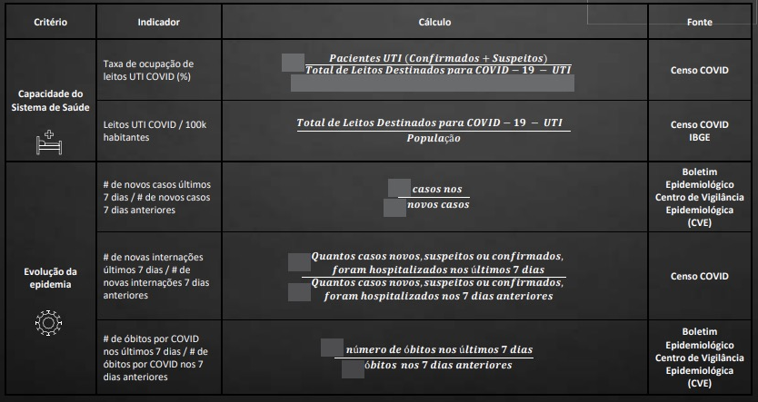

## Acompanhamento independente dos indicadores do Plano SP de reabertura

### Acesse o site: [https://dereooo.github.io/planosp/](https://dereooo.github.io/planosp/)

#### Descrição encontrada no [Site do Plano São Paulo](https://www.saopaulo.sp.gov.br/planosp/):

"A retomada consciente dos setores da economia começa a funcionar em 1º de junho. O estado está dividido em 17 Departamentos Regionais de Saúde, que estão categorizados segundo uma escala de cinco níveis de abertura econômica.
Cada região poderá reabrir determinados setores de acordo com a fase em que se encontra. As regras são: média da taxa de ocupação de leitos de UTI exclusivas para pacientes com coronavírus, número de novas internações no mesmo período e o número de óbitos.
A requalificação de fase para mais restritiva será feita semanalmente, caso a região tenha piora nos índices. Para que haja uma promoção a uma fase com menos restrições e mais aberturas, serão necessárias duas semanas.
O Plano São Paulo dá autonomia para que prefeitos diminuam ou aumentem as restrições de acordo com os limites estabelecidos pelo Estado, desde que apresentem os pré-requisitos embasados em definições técnicas e científicas."

##### *Mais informações no [decreto que institui e estabelece diretrizes para o plano](https://www.al.sp.gov.br/repositorio/legislacao/decreto/2020/decreto-64994-28.05.2020.html)*

#### Resumo das fases:

#### Resumo dos indicadores:

#### Fonte dos dados:

[Site da SEADE-Coronavirus](https://www.seade.gov.br/coronavirus/)

[Repositório no GitHub](https://github.com/seade-R/dados-covid-sp)

